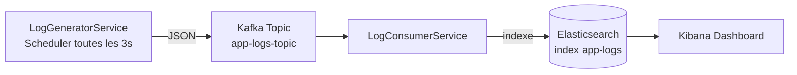

# 📊 Pipeline de Monitoring Temps Réel : Kafka, Elasticsearch & Kibana

Ce tutoriel construit, de zéro, un système d'observabilité applicative complet : un service Spring Boot génère en continu des logs simulés, les publie dans **Apache Kafka**, un consumer les indexe dans **Elasticsearch**, et **Kibana** les visualise dans un dashboard de monitoring en temps réel.

Ce document est écrit pour que vous puissiez **reproduire le projet from scratch** et **l'expliquer à quelqu'un d'autre** — chaque choix technique est justifié, et les erreurs les plus courantes sont documentées avec leur solution.

---

## 🎯 Ce que vous allez construire



1. Un service Spring Boot génère automatiquement des logs applicatifs fictifs (requêtes HTTP simulées sur 5 services, avec ~10% d'anomalies volontaires)
2. Chaque log est publié dans un topic Kafka
3. Un consumer Kafka lit ces messages et les indexe dans Elasticsearch
4. Kibana affiche un dashboard : taux d'erreur, latence par endpoint, répartition du trafic, tableau des erreurs récentes

**Pourquoi ce projet a de la valeur pédagogique et professionnelle :** c'est un mini système d'observabilité, comme ceux utilisés en entreprise (Datadog, Grafana + Loki) pour surveiller des microservices en production.

---

## 🧰 Prérequis

| Outil | Version | Vérification |
|---|---|---|
| JDK | 21 (LTS) | `java -version` |
| Maven | fourni par le wrapper (`mvnw`) | — |
| Docker Desktop | récent, avec le moteur démarré | `docker ps` |
| Git | — | `git --version` |
| Compte GitHub | — | — |

⚠️ **Piège fréquent sur Windows : `JAVA_HOME` mal configuré.** Si vous avez plusieurs JDK installés (ex: un ancien JDK 11 pour un vieux projet), Windows peut avoir deux variables `JAVA_HOME` différentes : une dans "Variables **utilisateur**", une dans "Variables **système**". La variable **utilisateur** gagne toujours. Vérifiez les deux si vous rencontrez une erreur `release version XX not supported` malgré un `java -version` correct. Solution fiable en ligne de commande :
```bash
setx JAVA_HOME "C:\Program Files\Eclipse Adoptium\jdk-21.0.8.9-hotspot"
```
Puis **fermez tous les terminaux ouverts** et testez dans un terminal neuf avec `echo %JAVA_HOME%` (sans taper de `set` manuel).

---

## 📁 Étape 1 — Créer le dépôt GitHub

1. Sur [github.com](https://github.com), cliquez sur **New repository**
2. Nom : `log-monitoring-kafka-elasticsearch`
3. Cochez **Add a README file**
4. **Create repository**

Clonez-le en local :
```bash
git clone https://github.com/VOTRE-PSEUDO/log-monitoring-kafka-elasticsearch.git
cd log-monitoring-kafka-elasticsearch
```

---

## ⚙️ Étape 2 — Générer le squelette Spring Boot

Allez sur [start.spring.io](https://start.spring.io) et configurez :

| Champ | Valeur |
|---|---|
| Project | Maven |
| Language | Java |
| Spring Boot | **3.4.2** |
| Group | `com.learn` |
| Artifact | `logs` |
| Java | 21 |

**Dependencies à ajouter :**
- Spring Web
- Spring for Apache Kafka
- Spring Data Elasticsearch
- Lombok
- Spring Boot Actuator

> ⚠️ **Pourquoi Spring Boot 3.4.2 et pas la dernière version (4.x) ?**
> Spring Boot 4.x embarque une version du client Elasticsearch (9.x) incompatible avec Elasticsearch **8.13** (utilisé dans ce projet via Docker). Cela provoque une erreur au démarrage :
> ```
> status: 400, [es/indices.exists] Expecting a response body, but none was sent
> ```
> Restez sur Spring Boot 3.x tant que votre Elasticsearch est en version 8.x — c'est la combinaison stable et documentée.

Cliquez sur **Generate**, un fichier `logs.zip` se télécharge.

**Extrayez ce zip directement dans le dossier cloné** (`log-monitoring-kafka-elasticsearch`), en fusionnant avec le `README.md` existant.

> ⚠️ **Piège fréquent : dossier dupliqué.** Si vous glissez le zip sans faire attention, l'extraction crée parfois un sous-dossier du même nom que le dossier parent (`log-monitoring-kafka-elasticsearch/log-monitoring-kafka-elasticsearch/`). Vérifiez toujours qu'après extraction, `pom.xml` et `src/` sont **directement** à la racine du dépôt, au même niveau que le `.git`.

---

## 🏗️ Étape 3 — Structure du projet

```
log-monitoring-kafka-elasticsearch/
├── docker-compose.yml
├── pom.xml
├── mvnw / mvnw.cmd
├── README.md
└── src/main/
    ├── java/com/learn/logs/
    │   ├── LogMonitoringApplication.java
    │   ├── model/
    │   │   └── LogEvent.java
    │   ├── service/
    │   │   ├── LogGeneratorService.java
    │   │   └── LogConsumerService.java
    │   └── repository/
    │       └── LogEventRepository.java
    └── resources/
        └── application.properties
```

---

## 🐳 Étape 4 — Infrastructure Docker

Créez `docker-compose.yml` à la racine :

```yaml
services:
  zookeeper:
    image: confluentinc/cp-zookeeper:7.5.0
    container_name: zookeeper
    environment:
      ZOOKEEPER_CLIENT_PORT: 2181
      ZOOKEEPER_TICK_TIME: 2000
    ports:
      - "2181:2181"

  kafka:
    image: confluentinc/cp-kafka:7.5.0
    container_name: kafka
    depends_on:
      - zookeeper
    ports:
      - "9092:9092"
    environment:
      KAFKA_BROKER_ID: 1
      KAFKA_ZOOKEEPER_CONNECT: zookeeper:2181
      KAFKA_ADVERTISED_LISTENERS: PLAINTEXT://localhost:9092
      KAFKA_OFFSETS_TOPIC_REPLICATION_FACTOR: 1

  elasticsearch:
    image: docker.elastic.co/elasticsearch/elasticsearch:8.13.4
    container_name: elasticsearch
    environment:
      - discovery.type=single-node
      - xpack.security.enabled=false
      - "ES_JAVA_OPTS=-Xms512m -Xmx512m"
    ports:
      - "9200:9200"
      - "9300:9300"
    volumes:
      - esdata:/usr/share/elasticsearch/data

  kibana:
    image: docker.elastic.co/kibana/kibana:8.13.4
    container_name: kibana
    depends_on:
      - elasticsearch
    environment:
      - ELASTICSEARCH_HOSTS=http://elasticsearch:9200
    ports:
      - "5601:5601"

volumes:
  esdata:
    driver: local
```

**Ce que fait chaque service :**
- **zookeeper** : coordonne le cluster Kafka (obligatoire pour Kafka < 4.0, qui n'a pas encore le mode KRaft généralisé en production)
- **kafka** : le broker de messages, reçoit et distribue les logs
- **elasticsearch** : base de données de recherche où sont indexés les logs
- **kibana** : interface web pour visualiser les données d'Elasticsearch

Lancez l'infrastructure :
```bash
docker-compose up -d
docker ps
```

> ⚠️ **Conflit de noms de conteneurs.** Si vous avez déjà un autre projet utilisant ces mêmes noms (`kafka`, `elasticsearch`, etc.), vous aurez une erreur `Conflict. The container name "/elasticsearch" is already in use`. Solution :
> ```bash
> docker rm kafka kibana zookeeper elasticsearch
> ```
> (uniquement s'ils sont arrêtés — sinon faites d'abord `docker-compose down` dans l'autre projet)

---

## ☕ Étape 5 — Le code Java, expliqué ligne par ligne

### `LogEvent.java` — le modèle de données

```java
package com.learn.logs.model;

import lombok.AllArgsConstructor;
import lombok.Data;
import lombok.NoArgsConstructor;
import org.springframework.data.annotation.Id;
import org.springframework.data.elasticsearch.annotations.Document;
import org.springframework.data.elasticsearch.annotations.Field;
import org.springframework.data.elasticsearch.annotations.FieldType;

import java.time.Instant;

@Data
@NoArgsConstructor
@AllArgsConstructor
@Document(indexName = "app-logs")
public class LogEvent {

    @Id
    private String id;

    @Field(type = FieldType.Keyword)
    private String service;

    @Field(type = FieldType.Keyword)
    private String endpoint;

    @Field(type = FieldType.Keyword)
    private String httpMethod;

    @Field(type = FieldType.Integer)
    private Integer statusCode;

    @Field(type = FieldType.Long)
    private Long responseTimeMs;

    @Field(type = FieldType.Keyword)
    private String level; // INFO, WARN, ERROR

    @Field(type = FieldType.Keyword)
    private String traceId;

    @Field(type = FieldType.Date)
    private Instant timestamp;
}
```

**Explications :**
- `@Data` (Lombok) génère automatiquement les getters/setters/toString/equals, évitant du code répétitif
- `@Document(indexName = "app-logs")` indique à Spring Data Elasticsearch que cette classe correspond à l'index Elasticsearch nommé `app-logs` — l'index sera créé automatiquement au premier démarrage
- `@Field(type = FieldType.Keyword)` : type `Keyword` = valeur exacte, non découpée pour la recherche full-text (idéal pour des catégories comme `service` ou `level`, qu'on veut filtrer/grouper exactement, pas "chercher un mot dedans")
- `@Field(type = FieldType.Date)` sur un `Instant` : Elasticsearch stockera cette date au format ISO8601, ce que Kibana reconnaît nativement comme axe temporel

> 💡 **Leçon apprise sur ce projet** : évitez de préciser un `format` personnalisé sur l'annotation `@Field(type = FieldType.Date)` (comme `date_hour_minute_second_millis`). Cela a cassé la détection automatique du champ temporel par Kibana lors du premier essai. Le format ISO8601 par défaut fonctionne toujours sans souci.

---

### `LogGeneratorService.java` — le producer simulé

```java
package com.learn.logs.service;

import com.fasterxml.jackson.databind.ObjectMapper;
import com.learn.logs.model.LogEvent;
import lombok.RequiredArgsConstructor;
import lombok.extern.slf4j.Slf4j;
import org.springframework.kafka.core.KafkaTemplate;
import org.springframework.scheduling.annotation.Scheduled;
import org.springframework.stereotype.Service;

import java.time.Instant;
import java.util.List;
import java.util.Random;
import java.util.UUID;

@Service
@RequiredArgsConstructor
@Slf4j
public class LogGeneratorService {

    public static final String TOPIC = "app-logs-topic";

    private final KafkaTemplate<String, String> kafkaTemplate;
    private final ObjectMapper objectMapper;
    private final Random random = new Random();

    private static final List<String> SERVICES = List.of(
            "payment-service", "order-service", "auth-service",
            "inventory-service", "notification-service"
    );

    private static final List<String> ENDPOINTS = List.of(
            "/api/checkout", "/api/orders", "/api/login",
            "/api/products", "/api/notify", "/api/refund"
    );

    private static final List<String> METHODS = List.of("GET", "POST", "PUT", "DELETE");

    @Scheduled(fixedRate = 3000)
    public void generateLogs() {
        int batchSize = 3 + random.nextInt(5);

        for (int i = 0; i < batchSize; i++) {
            LogEvent event = buildRandomEvent();
            try {
                String json = objectMapper.writeValueAsString(event);
                kafkaTemplate.send(TOPIC, json);
            } catch (Exception e) {
                log.error("Erreur lors de la serialisation du log", e);
            }
        }
        log.info("📤 {} logs generes et envoyes a Kafka", batchSize);
    }

    private LogEvent buildRandomEvent() {
        boolean isAnomaly = random.nextInt(100) < 10; // 10% d'anomalies

        String service = SERVICES.get(random.nextInt(SERVICES.size()));
        String endpoint = ENDPOINTS.get(random.nextInt(ENDPOINTS.size()));
        String method = METHODS.get(random.nextInt(METHODS.size()));

        int statusCode;
        long responseTime;
        String level;

        if (isAnomaly) {
            statusCode = random.nextBoolean() ? 500 : 503;
            responseTime = 800 + random.nextInt(2000);
            level = "ERROR";
        } else {
            statusCode = 200;
            responseTime = 20 + random.nextInt(300);
            level = "INFO";
        }

        return new LogEvent(
                UUID.randomUUID().toString(),
                service, endpoint, method,
                statusCode, responseTime, level,
                UUID.randomUUID().toString().substring(0, 8),
                Instant.now()
        );
    }
}
```

**Explications ligne par ligne :**
- `@Scheduled(fixedRate = 3000)` : Spring appelle automatiquement cette méthode toutes les 3000ms (3 secondes), sans qu'on ait besoin d'appeler un endpoint manuellement — c'est ce qui rend ce projet "vraiment temps réel", contrairement à une API externe qui ne se met à jour qu'une fois par jour
- `KafkaTemplate<String, String>` : l'objet Spring Kafka qui sait publier des messages ; ici on envoie des `String` (le JSON sérialisé), pas des objets Java directement
- La logique d'anomalie (`isAnomaly`, 10% de chance) simule volontairement des pannes réalistes : sans ça, le dashboard de monitoring n'aurait rien d'intéressant à montrer
- `objectMapper.writeValueAsString(event)` (Jackson) convertit l'objet Java `LogEvent` en texte JSON avant l'envoi — Kafka ne transporte que des données sérialisées (texte ou bytes), jamais des objets Java bruts

---

### `LogConsumerService.java` — l'indexation

```java
package com.learn.logs.service;

import com.fasterxml.jackson.databind.ObjectMapper;
import com.learn.logs.model.LogEvent;
import com.learn.logs.repository.LogEventRepository;
import lombok.RequiredArgsConstructor;
import lombok.extern.slf4j.Slf4j;
import org.springframework.kafka.annotation.KafkaListener;
import org.springframework.stereotype.Service;

@Service
@RequiredArgsConstructor
@Slf4j
public class LogConsumerService {

    private final LogEventRepository repository;
    private final ObjectMapper objectMapper;

    @KafkaListener(topics = LogGeneratorService.TOPIC, groupId = "log-monitoring-group")
    public void consume(String message) {
        try {
            LogEvent event = objectMapper.readValue(message, LogEvent.class);
            repository.save(event);
        } catch (Exception e) {
            log.error("Erreur lors de l'indexation du log", e);
        }
    }
}
```

**Explications :**
- `@KafkaListener(topics = ..., groupId = ...)` : Spring Kafka s'abonne automatiquement au topic dès le démarrage de l'application, et appelle `consume()` à chaque nouveau message reçu
- `groupId` identifie un "groupe de consumers" — si vous lanciez plusieurs instances de cette application, Kafka répartirait automatiquement la charge entre elles (pas utile ici avec une seule instance, mais c'est ce qui rend Kafka scalable en production)
- `objectMapper.readValue(message, LogEvent.class)` fait l'inverse du producer : reconvertit le texte JSON reçu en objet Java `LogEvent`
- `repository.save(event)` déclenche l'indexation dans Elasticsearch via Spring Data Elasticsearch — pas besoin d'écrire de requête HTTP manuelle, c'est géré automatiquement par le repository

---

### `LogEventRepository.java` — l'accès aux données

```java
package com.learn.logs.repository;

import com.learn.logs.model.LogEvent;
import org.springframework.data.elasticsearch.repository.ElasticsearchRepository;
import org.springframework.stereotype.Repository;

@Repository
public interface LogEventRepository extends ElasticsearchRepository<LogEvent, String> {
}
```

**Explications :**
- Cette interface est **vide**, et pourtant elle fonctionne — c'est le principe des repositories Spring Data : en héritant de `ElasticsearchRepository<LogEvent, String>` (`LogEvent` = le type de document, `String` = le type de son `@Id`), Spring génère automatiquement l'implémentation avec des méthodes comme `save()`, `findById()`, `findAll()`, `deleteById()` — sans écrire une seule ligne de requête Elasticsearch

---

### `LogMonitoringApplication.java` — le point d'entrée

```java
package com.learn.logs;

import org.apache.kafka.clients.admin.NewTopic;
import org.springframework.boot.SpringApplication;
import org.springframework.boot.autoconfigure.SpringBootApplication;
import org.springframework.context.annotation.Bean;
import org.springframework.kafka.config.TopicBuilder;
import org.springframework.scheduling.annotation.EnableScheduling;

import com.learn.logs.service.LogGeneratorService;

@SpringBootApplication
@EnableScheduling
public class LogMonitoringApplication {

    public static void main(String[] args) {
        SpringApplication.run(LogMonitoringApplication.class, args);
    }

    @Bean
    public NewTopic appLogsTopic() {
        return TopicBuilder.name(LogGeneratorService.TOPIC)
                .partitions(1)
                .replicas(1)
                .build();
    }
}
```

**Explications :**
- `@EnableScheduling` est **indispensable** : sans cette annotation, `@Scheduled` sur `LogGeneratorService` serait ignoré et aucun log ne serait généré automatiquement
- Le `@Bean appLogsTopic()` déclare explicitement le topic Kafka au démarrage — ce n'est pas strictement obligatoire (Kafka peut créer un topic automatiquement au premier message si `allow.auto.create.topics` est activé), mais le déclarer explicitement est une bonne pratique : ça documente son existence et permet de contrôler son nombre de partitions

---

### `application.properties`

```properties
spring.application.name=log-monitoring

spring.kafka.bootstrap-servers=localhost:9092
spring.kafka.consumer.group-id=log-monitoring-group
spring.kafka.consumer.auto-offset-reset=earliest
spring.kafka.consumer.key-deserializer=org.apache.kafka.common.serialization.StringDeserializer
spring.kafka.consumer.value-deserializer=org.apache.kafka.common.serialization.StringDeserializer
spring.kafka.producer.key-serializer=org.apache.kafka.common.serialization.StringSerializer
spring.kafka.producer.value-serializer=org.apache.kafka.common.serialization.StringSerializer

spring.elasticsearch.uris=http://localhost:9200
```

**Explications :**
- `bootstrap-servers=localhost:9092` : l'adresse du broker Kafka (le port exposé par le conteneur Docker)
- `auto-offset-reset=earliest` : si le consumer démarre et qu'il n'a jamais lu ce topic, il commence par le tout premier message disponible (plutôt que d'ignorer l'historique)
- Les `key-serializer`/`value-serializer` en `StringSerializer` : on choisit de transporter du texte JSON brut plutôt qu'un format binaire (comme Avro) — plus simple à déboguer, suffisant pour ce projet

---

## 🚀 Étape 6 — Lancer le projet

```bash
docker-compose up -d
docker ps    # vérifiez les 4 conteneurs "Up"

mvnw.cmd spring-boot:run
```

Vous devriez voir en boucle, toutes les 3 secondes :
```
📤 X logs generes et envoyes a Kafka
```

**Vérifiez l'indexation Elasticsearch :**
```bash
curl http://localhost:9200/_cat/indices?v
```
Un index `app-logs` doit apparaître, avec un `docs.count` qui augmente en continu.

---

## 📈 Étape 7 — Construire le dashboard Kibana

### 7.1 Créer le Data View

1. `http://localhost:5601/app/discover`
2. **Create a data view** → Index pattern : `app-logs` → Timestamp field : `timestamp` → Save

### 7.2 Visualisation 1 — Taux d'erreur dans le temps

- Type : **Line**
- Filtre KQL : `level: "ERROR"`
- Horizontal axis : `timestamp`, Date histogram, intervalle `10s`
- Vertical axis : `Count of records`

### 7.3 Visualisation 2 — Latence moyenne par endpoint

- Type : **Line**
- Horizontal axis : `timestamp`, Date histogram, `10s`
- Vertical axis : `Average` de `responseTimeMs`
- Breakdown : `endpoint` (Top 5)

### 7.4 Visualisation 3 — Répartition du trafic par service

- Type : **Donut**
- Slice by : `service`
- Metric : `Count of records`

### 7.5 Visualisation 4 — Tableau des erreurs récentes

> ⚠️ **Piège technique important.** L'éditeur "Lens" de Kibana (utilisé pour les 3 visualisations précédentes) est conçu pour des **agrégations** (moyennes, comptages par intervalle) — il ne sait pas bien afficher une liste de documents individuels ligne par ligne. Tenter d'y construire un tableau "brut" aboutit à des colonnes vides ou des agrégations indésirables (`Median of responseTimeMs`, etc.).
>
> **La bonne méthode** : construisez ce tableau dans **Discover**, pas dans Lens.

1. Allez dans **Discover**, Data View `app-logs`
2. Filtre KQL : `level: "ERROR"`
3. Ajoutez les colonnes (survol du champ dans la liste de gauche → icône `+`) : `service`, `endpoint`, `statusCode`, `responseTimeMs` (le `timestamp` est déjà présent par défaut)
4. **Save** cette recherche sous le nom `Erreurs récentes`

### 7.6 Assembler le dashboard

1. **Dashboard → Create dashboard**
2. Ajoutez les 3 visualisations (via **Create visualization**, avec "Add to dashboard: Existing")
3. Pour le tableau des erreurs, utilisez **Add from library** et sélectionnez la recherche Discover sauvegardée `Erreurs récentes`
4. Activez l'auto-refresh (icône horloge, 5-10s) pour un vrai effet temps réel
5. **Save**, nommez `Dashboard Monitoring - Logs applicatifs`

---

## 🐛 Récapitulatif des erreurs rencontrées et leurs solutions

| Erreur | Cause | Solution |
|---|---|---|
| `release version 21 not supported` | `JAVA_HOME` pointe vers un ancien JDK | Corriger `JAVA_HOME` (voir section Prérequis) |
| `Conflict. The container name "/elasticsearch" is already in use` | Un ancien projet a laissé des conteneurs Docker du même nom | `docker rm <noms>` |
| `package com.fasterxml.jackson.databind does not exist` | Dépendance Jackson manquante (dépend de la version de Spring Boot) | Utiliser Spring Boot 3.x avec `spring-boot-starter-web` (inclut Jackson) |
| `status: 400, Expecting a response body, but none was sent` | Client Elasticsearch (Spring Boot 4.x) incompatible avec le serveur Elasticsearch 8.x | Revenir à Spring Boot 3.4.2 |
| Kibana n'affiche aucun champ Timestamp au moment de créer le Data View | Mapping du champ `timestamp` incorrect (type `long` au lieu de `date`), ou cache Kibana obsolète | Vérifier le mapping via `curl http://localhost:9200/<index>/_mapping`, forcer un rechargement (`Ctrl+Shift+R`) |
| Tableau Lens avec des colonnes vides / agrégées de façon inattendue | Lens force des agrégations, inadapté à une liste de documents bruts | Utiliser une recherche **Discover** sauvegardée à la place |

---

## 🎓 Pour aller plus loin

- Ajouter un **endpoint REST** manuel (`POST /logs`) pour permettre à un vrai service externe d'envoyer des logs, en plus du générateur automatique
- Ajouter des **alertes Kibana** (Stack Management → Rules) déclenchées si le taux d'erreur dépasse un seuil
- Répliquer Elasticsearch sur plusieurs nœuds pour simuler un vrai cluster de production
- Ajouter des **dashboards Grafana** en complément, pour comparer les deux outils de visualisation

---

## 👨‍💻 Auteur

- **Prénom** : Salomon
- **Nom** : TSHAUKE-MULUMBA
- **Contact** : [tshaukemulumba@yahoo.com](mailto:tshaukemulumba@yahoo.com)
